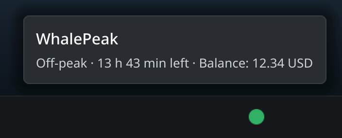
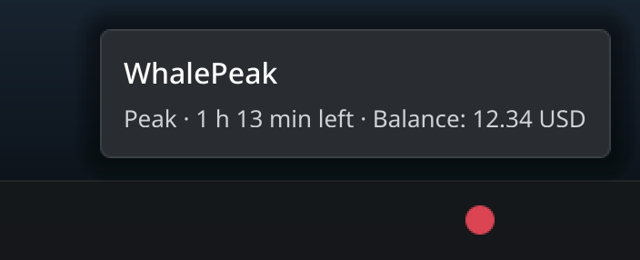
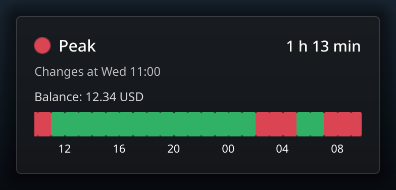
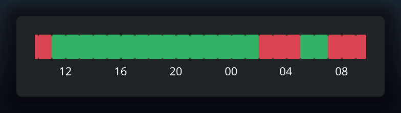
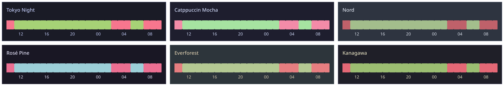

# WhalePeak


A Plasma 6 widget that shows the current DeepSeek tariff status (peak/off-peak)
and the local timeline of the next tariff changes.

## Appearance

Every image is rendered from the widget's own QML with `make images` - no screen
capture - and uses a fixed demo instant, so the pictures stay reproducible.





The panel carries only the status dot: green for off-peak, red for peak.
Hovering shows the tooltip with the state, the time until the next change and
the balance; each example carries the text that belongs to its state.



The expanded window in "combined" mode: the status line, the next change in the
local clock, the remaining balance and the timeline for the next 24 hours.



The same window with the display mode "timeline" and the solid background.



One strip per palette - Tokyo Night, Catppuccin Mocha, Nord, Rosé Pine,
Everforest and Kanagawa. The colours are described in
[Color themes](#color-themes).

## Requirements

- KDE Plasma 6 (`kpackagetool6`)
- `python3` (only to build/install the package)
- Node.js >= 18 (only for `make test`)
- Qt 6 QML runtime (`qml6`, package `qt6-declarative-dev-tools`) - only for
  `make probe` and `make images`
- ImageMagick (`magick` or `convert`) - optional, for the icon in the widget
  menu and for the palette mosaic of `make images`
- `kwallet-query` (package `kwallet6` or `kwalletmanager`) - only for the
  optional remaining balance

## Installation

**Through the Plasma UI (recommended)** - only the file `whalepeak.plasmoid` is
needed (from `dist/`, see below):

1. Right-click the panel/desktop → *Add or Manage Widgets…*
2. Top left *Get New…* → *Install Widget From Local File…*
3. Select `whalepeak.plasmoid` and confirm.
4. Add the widget via *Edit Panel → Add Widgets* → "WhalePeak".

> The `.plasmoid` contains only `metadata.json` and `contents/`; the icon lives
> in the icon theme and can be installed with `tools/install.sh --icon-only`.

**From source (development):**

```sh
make install    # install or update (including the icon)
make update     # additionally restart plasmashell (makes QML/icon changes visible)
make check      # compare the installed version with the source
make uninstall  # remove the applet and the icon
```

## Settings

Right-click the widget → *Settings…*:

- **Display mode** – combined, status line only or timeline only
- **Background** – glass (default), solid or transparent
- **Opacity** – only for "glass", 0–100 % (default 55 %)
- **Color theme** – Plasma color scheme (default) or one of the bundled palettes
- **Holidays / workdays** – one line per entry (`2026-10-01=holiday`,
  `2026-10-10=workday`, `#` for comments). Invalid lines are ignored and
  counted.
- **Treat weekend makeup workdays as peak** – a weekend entered as `workday`
  counts as peak only with this option.
- **Remaining balance** – show the remaining balance (see below).

Without custom entries only the base rule applies: **weekdays are peak, weekends
are off-peak** – no holiday calendar is bundled. As soon as at least one entry
exists and the forecast touches a year without entries, *Calendar coverage
incomplete* appears. The interface is currently available in English only
(`po/` is still missing).

## Usage

- **Left click on the status dot** or **right-click → *Show details***
  expands the widget.
- **Middle click on the status dot** or **right-click → *Open DeepSeek usage
  page*** opens the DeepSeek usage page <https://platform.deepseek.com/usage>.

## Setting up the remaining balance

1. Create an API key at <https://platform.deepseek.com/api_keys>.
2. *Settings… → Remaining balance →* tick **Show remaining balance**.
3. Enter the key in **API key** and press **Save to wallet** – it goes into
   KWallet (`kdewallet` / `DeepSeek` / `api_key`) and is verified immediately.

## Color themes

Besides the Plasma color scheme the widget bundles six palettes that color the
card, status dot and timeline:

| Theme | Source (MIT license) |
| --- | --- |
| Tokyo Night | <https://github.com/tokyo-night/tokyo-night-vscode-theme> |
| Catppuccin Mocha | <https://github.com/catppuccin/palette> |
| Nord | <https://www.nordtheme.com/docs/colors-and-palettes> |
| Rosé Pine | <https://rosepinetheme.com/palette> |
| Everforest | <https://github.com/sainnhe/everforest> |
| Kanagawa | <https://github.com/rebelot/kanagawa.nvim> |

## Direct script calls

If `make` is not at hand:

| Command | Effect |
| --- | --- |
| `tools/install.sh` | install or update |
| `tools/install.sh --restart` | additionally restart plasmashell |
| `tools/install.sh --check` | compare versions and icon status |
| `tools/install.sh --icon-only` | install only the icon again |
| `tools/kwallet-set.sh` | store the API key in KWallet (`--check` checks the entry, otherwise the key via stdin) |
| `tools/uninstall.sh` | uninstall |

## License

GPL-2.0-or-later, see `LICENSE`. This matches the `"License"` field in
`metadata.json`.
